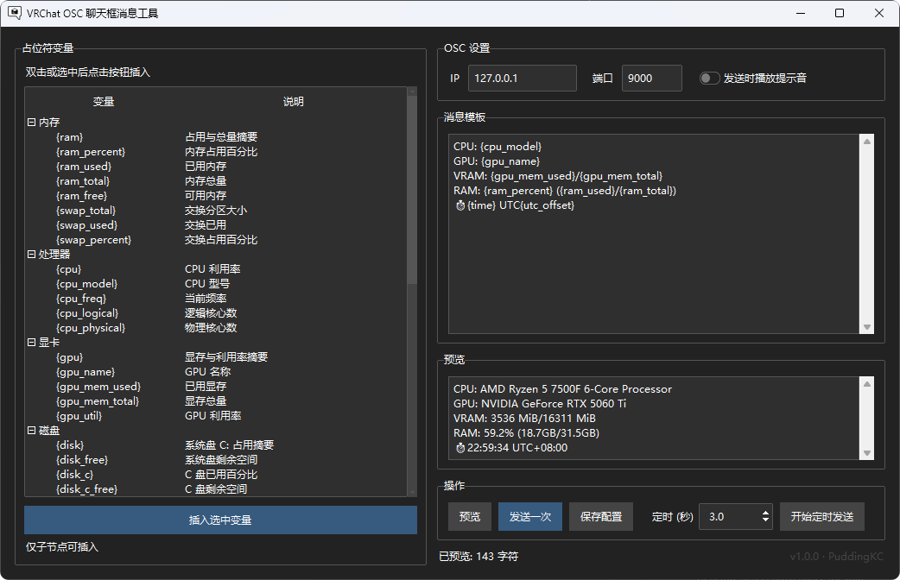

# VRChat OSC ChatBox
通过 OSC 向 VRChat 发送聊天框文字，可以显示电脑信息或其他自定义内容。  
支持模板占位符（CPU、GPU、内存、时间、日期等），可预览与定时发送。

> 反馈交流群: 1047423396



## 环境
- Python 3.10+

## 扩展变量
在 `vrc_osc_chatbox/variables/registry.py` 的 `EXTRA_PLACEHOLDER_CATEGORIES` 中追加分类与变量。

## 运行
```bash
pip install -r requirements.txt
python -m vrc_osc_chatbox
```
